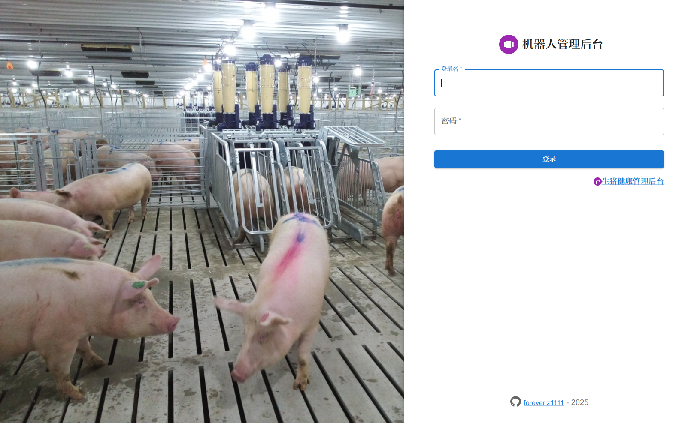
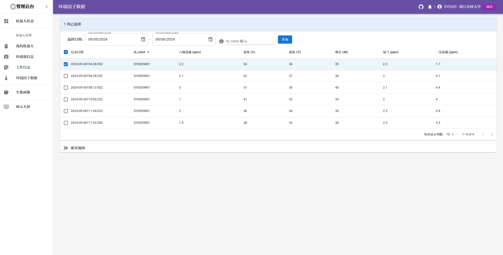

 
### 机器人 + 信息管理

### 目录

- [scope](scope) 设计原型图，使用 Axure 9
- [database](database) 数据库设计与DML，使用MySql
- [web](web) 页面 使用 React 18 + Material UI 5.17 + Next.js Router 5.16
- [api](api) 接口 使用 GO 1.23 + gin + Sqlc, database + Sqlx
- [test_case](test_case) 测试用例