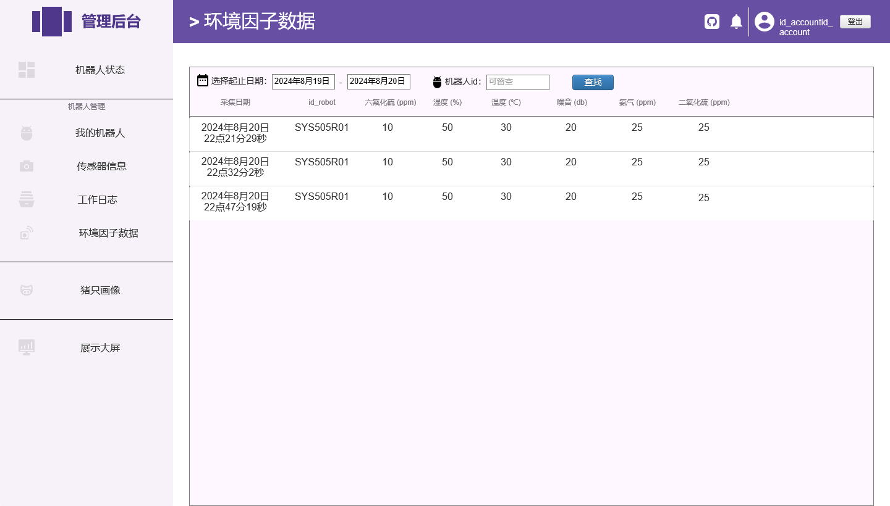

### 目标

一个机器人管理系统及机器人状态展示大屏

机器人管理核心功能：机器人信息+ 机器人实时状态 + 传感器信息

机器人状态展示大屏核心功能：机器人部分实时状态 + 传感器数据可视化
### 工作流程

管理系统 web 作为展示 ->> 服务器处理请求 api ->> 数据库

### 需求

1. 机器人整机软硬件和已安装传感器的版本信息
2. 机器人内部和外部硬件配置信息，生产日期和购买日期等信息（information）
2. 机器人当前状态信息（电量、运动状态等）
3. 机器人运行工作日志
3. 机器人环境因子传感器数据及日志
4. 用户登录认证
5. 机器人视觉传感器数据及日志
6. 生猪画像，记录拍摄到的猪只的图像，进行标号
6. 大屏幕内嵌于管理系统中，将获取到的机器人信息可视化
7. 登录界面预留转跳按钮，按钮至其他系统

### 页面

1. 登录页面
> 左右分屏，左边放图，右边登录页面。登录页面需要包含1个跳转其他系统的按钮入口。用户名和密码登录，可记住密码。忘记密码按钮

2. 主页面
> 主页面采用后台管理布局，布局密度一般，字体正常，方便阅读。页面左边为导航树，导航树宽度避免过大。页面右边：顶部为带标题的导航栏，导航栏不随页面滑动；下方当前导航树所控制的功能内容页面 

> 导航的“机器人状态”为一级。主面板内容的顶部包括一个下拉栏，选择当前展示的机器人关键信息。左边机器人的图片，右边机器人关键状态信息和软硬件信息

> 导航栏的“机器人管理”包含：我的机器人（购买信息）、传感器信息、工作日志、环境因子日志

> "我的机器人"为一级，页面使用列表展示，可以添加机器人。每列可以编辑和删除

> "传感器信息"为一级，页面使用列表展示。按日期查找传感器采集的信息

> "工作日志"为一级，页面使用列表展示。按日期查找机器人工作记录，主要为导航和建图信息

> "环境因子数据"为一级，页面使用列表展示。按日期查找机器人收集的环境因子数据

> 导航栏的“猪只画像”为一级，页面使用列表展示。可单一详情展示该生猪条目被拍摄的图片

> 导航栏的“展示大屏”。机器人传感器、机器人状态和机器人环境因子的可视化
