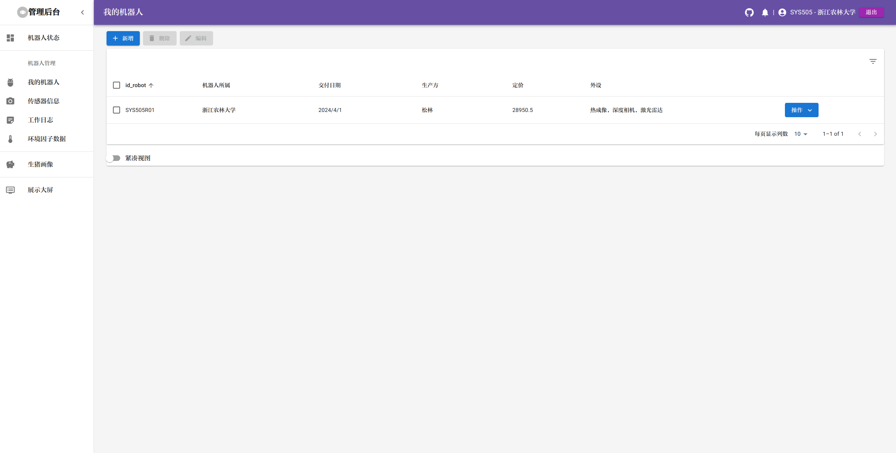

#### 基于模板 [material-ui-nextjs-pages-router](https://github.com/mui/material-ui/tree/master/examples/material-ui-nextjs) :
> 使用 Material UI 5.16.7

> 使用 React 18

> 使用 Next 14.2.8 (router)

> main 使用 <page/\>

#### 使用方式

安装依赖
> npm install

运行
> npm run dev